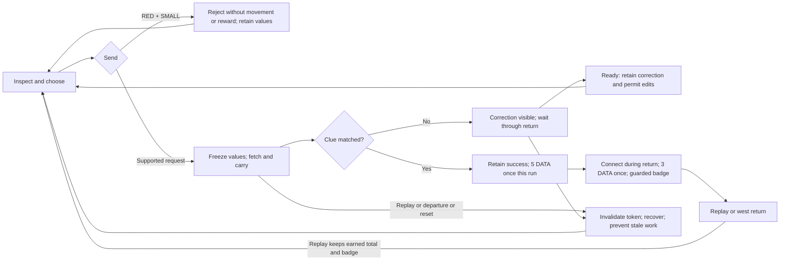

# Implementation plan — bounded source repair

Status: design proposal only. Source target: `Content/fn_shoreline_island_prompt_workshop.verse`. Zero scene delta; preserve every existing transform/property/binding. Generated zone/device reconciliation entries are inspect-and-preserve intentions, not placement commands. Existing binary modifications and 061 are untouched.

## Adapter reconciliation and provenance

Reuse prompt_workbench, knowledge_room, corridor and reward_room contracts. prompt_workbench still cites feature 023; current concrete implementation is feature 027 `fn_shoreline_island_prompt_workshop`, not `fn_shoreline_island_prompt_lab_controller`. Do not bind the obsolete adapter, add a controller, or treat choice_count/shared_state as generic configurability. Per-player choices coexist with one serialized shared physical animation. Solo scope controls. Knowledge-room duration is historical teaching intent; no new timer/stage is added.

027 `workshop-bindings-and-retirement.json` records configured=true and refs for controller, ten buttons, two HUDs/two boards and seven props. Earlier partial readback configured=false/entry dimensions are intermediate, not final configuration. Historical `workshop-scene-partial-readback.json` records red/large-blue sphere scale2.5, small-blue1.5. This supports RED+LARGE baseline, subject to fresh representation verification. No scale change/fourth prop is proposed.

Origin [2900,-600,2400] world cm and 88×28m floor union derive from 027 measured floor readback. Zone sizes, routes and marker positions in map.yaml are inherited SCHEMATIC flow annotations, not actor transforms, collision extents or measured player standing positions. Actual current geometry is unknown; zero spatial delta avoids choosing new placements. Preserve floors/garden walkway. Readback before implementation must establish actual refs and current configuration; discrepancies requiring scene changes return to planning.

## State/control policy

Use minimal state fields in the existing per-player state to retain result/correction and phase. Derive shared execution from execution_owner; do not create a second busy authority. Set owner/token synchronously before spawn as today. Preserve captured WHAT/WHICH/WHERE as the submission. Reject RED+SMALL after completeness and existing guard checks, before generation/owner reservation; keep choices, zero motion/reward and immediate edit readiness.

| Phase | Selector / Send policy | Existing persistent request + journal NEXT |
| --- | --- | --- |
| Before Inspect / incomplete / ready | Existing Inspect and incomplete checks; edits permitted | Existing next missing detail or Send |
| Fetch/carry | Reject selectors; Send rejected | “Watch Pix try this request. Wait before changing it.” |
| Wrong result hold / return | Reject selectors; Send rejected; show matrix correction | Correction plus “Pix is returning. Wait before changing it.” |
| Wrong ready | Edits permitted; new Send uses current values | Retained matrix correction, then “Change a detail, then SEND TO PIX.” |
| Correct delivery / return / delivered ready | Freeze values; Send does not restart; valid Connect permitted | “Walk east to CONNECT. Replay starts a new request.” |
| Connected, including remaining return | Freeze values; repeated Connect inert | “REPLAY or walk back west.” |

Rejected selector during execution: “Pix is showing this request. Change it when Pix is ready.” Busy Send: “Wait for Pix to finish, then try again.” Delivered edit cue: “This request powered the module. CONNECT, or Replay for a new request.” Connected edit cue: existing already-connected/Replay notice. Inspect may show clue in temporary feedback; it never mutates the submitted values or persistent result. Clear old correction on a successful accepted edit/new submission/Replay as appropriate; retain it at wrong readiness. Persistent fields feed the existing request HUD and `next_step` journal path. No competing widget.

## Cancellation transaction and stop condition

Add current owner/generation checks at run entry, immediately before each movement, after every suspension and between core/Pix return moves. No stale result/state/reward/module mutation may follow invalidation. Carry loop already checks per frame; preserve it. Replay/exit/departure/respawn/round invalidation remains available ahead of selector rejection. Preserve reward flags/lifetime and successful commitment order.

Initial supported source strategy: token-boundary checks plus existing reset_props recovery, with a mandatory cooked test of cancellation during each native MoveTo and immediate replacement Send. Token checks prevent later work; they do not prove interruption of an already running MoveTo. Before acceptance, observe that canceled motion cannot continue into the replacement attempt. If native motion persists after reset, STOP implementation acceptance; do not conceal it with a delay or claim solved. Scout/Implementer must propose a concrete supported cancellation-aware race/event or serialized drain design with evidence. Any added wait/changed flow or general movement refactor requires regenerated review and human approval. No speculative engine/API support is authorized here.

## Ordered handoff

1. Actual human approval of spec/matrix/state policy and generated digest. No fabricated approval; no current authorization for gameplay mutation.
2. Restore official live editor/MCP access, verify project/game state, read current bindings/props/entry and preserve unrelated baseline changes. Record live prerequisite evidence. execution_boundary specifies the stop policy, not passed runtime acceptance; regenerate if scope changes and keep approval digest current. Run `plan --ready`; failure stops mutations.
3. Implement source-only changes using current adapter; keep all native device configuration unchanged. Record exact source delta and checkpoint. Build Verse and validate/cook.
4. Independent QA checks AC01–06 with expected/actual evidence, eight combinations, six controls × phases, cancellation matrix, rewards, solo travel and no actor delta. Repair only approved scope; material deviation returns to design.
5. Human observations AC07 remain explicitly pending until supplied; automation cannot pass them. Stop any active game, verify nonrunning state and leave editor open before final completion claim.

No gameplay check is marked complete. Historical no-game instructions are not current restrictions; the current user explicitly requested implementation and independent QA after approval.

## Behavior diagram (zero spatial delta)

Exact feedback/state tables are also map controller settings, binding meaningful behavior into generated implementation.yaml and its review manifest. Generated geometry is unchanged schematic context only.
